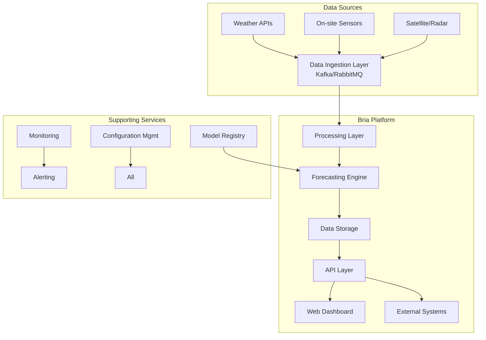
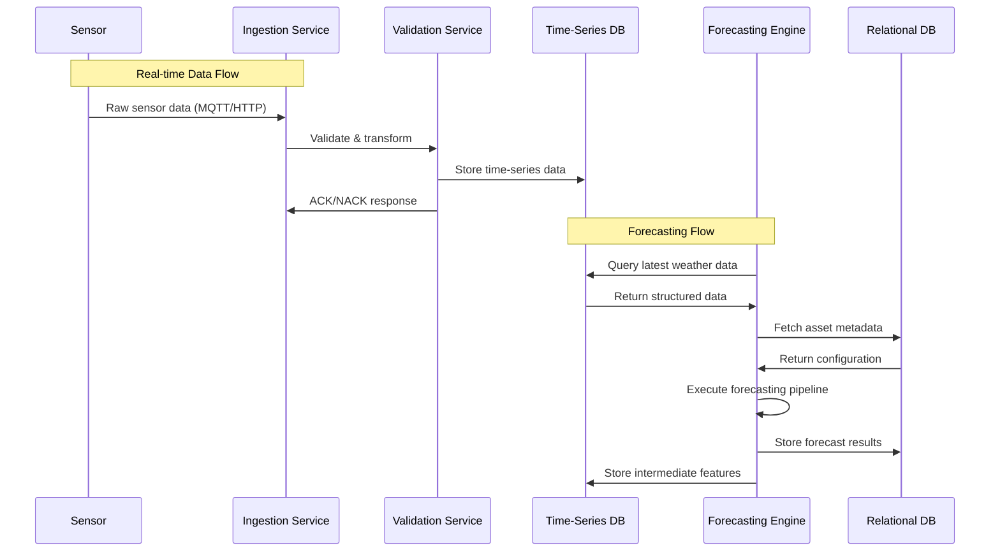

# **Bria - Technical Requirements Document (TRD)**

## **Version 2.0**  
**Date:** 2025-12-08  
**Status:** Final  
**Distribution:** Engineering, Product, Architecture Teams  

---

## **Executive Summary**

**Bria** is an enterprise-grade renewable power forecasting platform that combines meteorological data, physical modeling, and machine learning to deliver accurate generation forecasts for solar plants and wind farms. This document provides comprehensive technical specifications for the design, development, and deployment of the Bria platform.

---

## **Table of Contents**

1. [Document Purpose & Scope](#1-document-purpose--scope)
2. [System Architecture](#2-system-architecture)
3. [Functional Requirements](#3-functional-requirements)
4. [Non-Functional Requirements](#4-non-functional-requirements)
5. [Data Architecture](#5-data-architecture)
6. [Technology Stack](#6-technology-stack)
7. [Security & Compliance](#7-security--compliance)
8. [Operational Requirements](#8-operational-requirements)
9. [Appendix](#9-appendix)

---

## **1. Document Purpose & Scope**

### **1.1 Purpose**
This Technical Requirements Document (TRD) serves as the authoritative reference for the design, implementation, and validation of the Bria platform. It ensures alignment between business objectives, user requirements, and technical implementation.

### **1.2 In Scope**
- Solar PV and wind turbine generation forecasting
- Real-time weather data ingestion and processing
- Hybrid (ML + Physics) forecasting models
- API interfaces and dashboard visualization
- Multi-tenant, scalable cloud architecture

### **1.3 Out of Scope**
- Direct SCADA control of physical assets
- Financial settlement and billing systems
- Hardware device management
- Regulatory market bidding execution

---

## **2. System Architecture**

### **2.1 High-Level Architecture**



### **2.2 Component Architecture**

#### **2.2.1 Data Ingestion Layer**
```yaml
Components:
  - IoT Gateway: MQTT/Modbus protocol conversion
  - API Connectors: REST/WebSocket integrations
  - Message Broker: Kafka for event streaming
  - Data Validator: Real-time quality checks
  
Key Specifications:
  - Throughput: 10,000+ messages/second
  - Latency: < 100ms end-to-end
  - Protocol Support: MQTT, HTTP, WebSocket, Modbus TCP
```

#### **2.2.2 Processing Layer**
```yaml
Services:
  - Data Cleaning Service: Outlier detection, interpolation
  - Normalization Service: Unit conversion, scaling
  - Enrichment Service: Spatial/temporal alignment
  
Processing Rules:
  - Missing Data: Linear interpolation < 15min gaps
  - Outliers: 3-sigma rule with manual override
  - Validation: Cross-sensor correlation checks
```

#### **2.2.3 Forecasting Engine**
```python
# Core Engine Architecture
class ForecastingEngine:
    def __init__(self):
        self.physics_models = {
            'solar': SolarPhysicsModel(),
            'wind': WindPhysicsModel()
        }
        self.ml_models = {
            'solar': XGBoostSolarModel(),
            'wind': LSTMWindModel()
        }
        self.ensemble = WeightedEnsemble()
    
    def forecast(self, weather_data, horizon):
        # 1. Run physics models
        physics_result = self._run_physics(weather_data)
        
        # 2. Run ML models
        ml_result = self._run_ml(weather_data)
        
        # 3. Ensemble with confidence weighting
        final_forecast = self.ensemble.combine(
            physics_result, ml_result,
            confidence_scores=[0.6, 0.4]
        )
        
        return final_forecast
```

#### **2.2.4 API Layer**
```yaml
Endpoints:
  - /v1/forecasts: Real-time forecast retrieval
  - /v1/historical: Historical data access
  - /v1/assets: Asset management
  - /v1/alerts: Alert configuration/retrieval
  
Authentication:
  - OAuth2.0 with JWT tokens
  - API Key rotation every 90 days
  - Rate limiting per tenant
```

---

## **3. Functional Requirements**

### **3.1 Weather Data Management**

| ID | Requirement | Priority | Acceptance Criteria |
|----|-------------|----------|-------------------|
| **FR-01** | Ingest multi-source weather data | P0 | Support ≥3 data sources simultaneously |
| **FR-02** | Configurable ingestion frequency | P1 | 1min to 1hr intervals, default 5min |
| **FR-03** | Real-time data validation | P0 | Detect anomalies within 30 seconds |
| **FR-04** | Automatic data gap filling | P1 | Interpolate gaps ≤15 minutes |

### **3.2 Solar Forecasting**

| ID | Requirement | Priority | Acceptance Criteria |
|----|-------------|----------|-------------------|
| **FR-05** | Short-term solar forecast (0-6h) | P0 | Update every 15min, MAE <5% |
| **FR-06** | Day-ahead forecast (24-72h) | P0 | Hourly resolution, MAE <15% |
| **FR-07** | Temperature derating model | P1 | Include NOCT/NOCT-like models |
| **FR-08** | Panel degradation tracking | P2 | Model 0.5-1% annual degradation |

### **3.3 Wind Forecasting**

| ID | Requirement | Priority | Acceptance Criteria |
|----|-------------|----------|-------------------|
| **FR-09** | Real-time wind power forecast | P0 | 5-min updates, MAE <8% |
| **FR-10** | Turbine-specific power curves | P0 | Support custom power curves |
| **FR-11** | Cut-in/cut-out modeling | P0 | Configurable thresholds |
| **FR-12** | Wake effect modeling | P2 | Jensen/PARK models |

### **3.4 Hybrid Forecasting**

| ID | Requirement | Priority | Acceptance Criteria |
|----|-------------|----------|-------------------|
| **FR-13** | ML model integration | P0 | XGBoost/LSTM support |
| **FR-14** | Automated model retraining | P1 | Weekly retraining schedule |
| **FR-15** | Confidence interval calculation | P1 | P10/P50/P90 percentiles |
| **FR-16** | Model versioning & rollback | P2 | Semantic versioning support |

### **3.5 API & Integration**

| ID | Requirement | Priority | Acceptance Criteria |
|----|-------------|----------|-------------------|
| **FR-17** | RESTful API with JSON | P0 | OpenAPI 3.0 specification |
| **FR-18** | GraphQL support | P2 | Optional GraphQL endpoint |
| **FR-19** | WebSocket for real-time | P1 | Live forecast updates |
| **FR-20** | SCADA/EMS integration | P1 | IEC 61850/DNP3 support |

### **3.6 Visualization**

| ID | Requirement | Priority | Acceptance Criteria |
|----|-------------|----------|-------------------|
| **FR-21** | Real-time dashboard | P0 | <2s page load, auto-refresh |
| **FR-22** | Forecast vs actual | P0 | Side-by-side comparison |
| **FR-23** | Weather overlays | P1 | Satellite/radar integration |
| **FR-24** | Mobile-responsive UI | P1 | Tablet/mobile support |

---

## **4. Non-Functional Requirements**

### **4.1 Performance Requirements**

| Metric | Requirement | Measurement Method |
|--------|-------------|-------------------|
| API Response Time | <2s (p95) | Synthetic monitoring |
| Forecast Computation | <5min per site | End-to-end timing |
| Data Ingestion Latency | <100ms | Message timestamp diff |
| Concurrent Users | 100+ active sessions | Load testing |
| Data Throughput | 10K msg/sec | Message broker metrics |

### **4.2 Reliability Requirements**

| Metric | Requirement | Strategy |
|--------|-------------|----------|
| Uptime SLA | 99.9% monthly | Multi-AZ deployment |
| RTO (Recovery Time) | <15 minutes | Automated failover |
| RPO (Data Loss) | <5 minutes | Continuous replication |
| Data Retention | 7 years raw, 3 years processed | Tiered storage |

### **4.3 Scalability Requirements**

```yaml
Horizontal Scaling:
  - Stateless services: Auto-scale based on CPU/memory
  - Stateful services: Sharding by site/tenant
  - Database: Read replicas + connection pooling
  
Vertical Scaling Limits:
  - Max sites per instance: 100
  - Max forecasts per hour: 10,000
  - Max API requests/sec: 1,000
  
Multi-Tenancy:
  - Data isolation: Schema-per-tenant
  - Resource quotas: CPU/memory/API limits
  - Billing integration: Usage tracking
```

---

## **5. Data Architecture**

### **5.1 Database Schema**

```sql
-- Core Tables
CREATE TABLE sites (
    id UUID PRIMARY KEY DEFAULT gen_random_uuid(),
    name VARCHAR(255) NOT NULL,
    type SITE_TYPE NOT NULL, -- 'solar', 'wind', 'hybrid'
    latitude DECIMAL(9,6) NOT NULL,
    longitude DECIMAL(9,6) NOT NULL,
    capacity_mw DECIMAL(10,2) NOT NULL,
    timezone VARCHAR(50) NOT NULL,
    tenant_id UUID NOT NULL REFERENCES tenants(id),
    created_at TIMESTAMPTZ DEFAULT NOW(),
    updated_at TIMESTAMPTZ DEFAULT NOW()
);

CREATE TABLE weather_stations (
    id UUID PRIMARY KEY DEFAULT gen_random_uuid(),
    site_id UUID NOT NULL REFERENCES sites(id) ON DELETE CASCADE,
    station_code VARCHAR(100) UNIQUE NOT NULL,
    manufacturer VARCHAR(100),
    coordinates GEOGRAPHY(POINT, 4326),
    elevation_m DECIMAL(6,1),
    commissioned_at DATE,
    decommissioned_at DATE,
    status STATION_STATUS DEFAULT 'active'
);

-- Time-Series Data (TimescaleDB hypertable)
CREATE TABLE weather_readings (
    time TIMESTAMPTZ NOT NULL,
    station_id UUID NOT NULL,
    ghi DECIMAL(8,2), -- W/m²
    dni DECIMAL(8,2),
    dhi DECIMAL(8,2),
    wind_speed DECIMAL(5,2), -- m/s
    wind_direction DECIMAL(5,2), -- degrees
    ambient_temp DECIMAL(5,2), -- °C
    panel_temp DECIMAL(5,2),
    air_pressure DECIMAL(7,2), -- hPa
    humidity DECIMAL(5,2), -- %
    precipitation DECIMAL(5,2), -- mm
    quality_score DECIMAL(3,2) DEFAULT 1.0,
    raw_value JSONB
);

-- Convert to hypertable
SELECT create_hypertable('weather_readings', 'time');

-- Production Data
CREATE TABLE production_actuals (
    time TIMESTAMPTZ NOT NULL,
    site_id UUID NOT NULL,
    power_kw DECIMAL(10,3),
    energy_kwh DECIMAL(10,3),
    availability DECIMAL(5,2),
    curtailed_kw DECIMAL(10,3)
);

-- Forecasts
CREATE TABLE forecasts (
    id UUID PRIMARY KEY DEFAULT gen_random_uuid(),
    site_id UUID NOT NULL REFERENCES sites(id),
    forecast_time TIMESTAMPTZ NOT NULL,
    target_time TIMESTAMPTZ NOT NULL,
    horizon INTERVAL NOT NULL, -- Forecast horizon
    forecast_type FORECAST_TYPE NOT NULL,
    predicted_power_kw DECIMAL(10,3),
    p10_kw DECIMAL(10,3),
    p50_kw DECIMAL(10,3),
    p90_kw DECIMAL(10,3),
    confidence DECIMAL(4,3),
    model_version VARCHAR(50),
    features_used JSONB,
    created_at TIMESTAMPTZ DEFAULT NOW()
);

-- Model Registry
CREATE TABLE model_registry (
    id UUID PRIMARY KEY DEFAULT gen_random_uuid(),
    name VARCHAR(255) NOT NULL,
    type MODEL_TYPE NOT NULL,
    version VARCHAR(50) NOT NULL,
    storage_path TEXT NOT NULL,
    metrics JSONB NOT NULL,
    training_data_range DATERANGE,
    deployed_at TIMESTAMPTZ,
    is_active BOOLEAN DEFAULT FALSE,
    created_at TIMESTAMPTZ DEFAULT NOW()
);

-- Indexing Strategy
CREATE INDEX idx_weather_readings_time_station 
ON weather_readings (time DESC, station_id);

CREATE INDEX idx_production_site_time 
ON production_actuals (site_id, time DESC);

CREATE INDEX idx_forecasts_lookup 
ON forecasts (site_id, target_time, forecast_time);
```

### **5.2 Data Flow Patterns**



### **5.3 Data Retention Policy**

| Data Type | Retention Period | Storage Tier | Archival Strategy |
|-----------|-----------------|--------------|-------------------|
| Raw Sensor Data | 30 days | Hot storage | Real-time ingestion |
| Processed Weather | 7 years | Warm storage | Monthly compression |
| Forecast Results | 3 years | Warm storage | Daily aggregation |
| Model Artifacts | Permanent | Cold storage | Versioned S3 |
| Audit Logs | 10 years | Cold storage | Encrypted archive |

---

## **6. Technology Stack**

### **6.1 Backend Services**

```yaml
Programming Languages:
  Primary: Python 3.11+ (FastAPI, Pydantic, AsyncIO)
  Secondary: Go 1.21+ (high-performance services)
  ML: Python (scikit-learn, XGBoost, PyTorch)

Web Framework:
  FastAPI: REST/WebSocket APIs with OpenAPI
  GraphQL: Strawberry for optional GraphQL support
  Background Tasks: Celery with Redis/RabbitMQ

Data Processing:
  Pandas: Data manipulation
  NumPy: Numerical computations
  Dask: Distributed processing for large datasets

Machine Learning:
  Core: scikit-learn, XGBoost, LightGBM
  Deep Learning: PyTorch (optional)
  Feature Store: Feast
  Experiment Tracking: MLflow
  Model Serving: BentoML/TorchServe
```

### **6.2 Data Storage**

```yaml
Time-Series Database:
  Primary: TimescaleDB (PostgreSQL extension)
  Alternative: InfluxDB 2.x (for high-frequency IoT)
  Cache: Redis Cluster (session/store, rate limiting)

Relational Database:
  Primary: PostgreSQL 15+ with TimescaleDB
  Replication: 1 primary + 2 read replicas
  Connection Pooling: PgBouncer

Object Storage:
  Primary: AWS S3 / Azure Blob Storage
  Use Cases: Model artifacts, large files, backups

Search & Analytics:
  Elasticsearch: Logs, events, text search
  Apache Spark: Large-scale analytics (optional)
```

### **6.3 Infrastructure**

```yaml
Containerization:
  Docker: Container runtime
  Base Images: Python-slim, Ubuntu LTS

Orchestration:
  Kubernetes: Production orchestration
  Helm: Deployment charts
  Ingress: Nginx / Traefik

Cloud Providers:
  Primary: AWS (EKS, RDS, S3)
  Secondary: Azure (AKS), GCP (GKE)
  Multi-cloud: Terraform for infrastructure-as-code

Monitoring & Observability:
  Metrics: Prometheus + Grafana
  Logging: ELK Stack (Elasticsearch, Logstash, Kibana)
  Tracing: Jaeger / OpenTelemetry
  APM: Datadog / New Relic (optional)
```

### **6.4 Messaging & Streaming**

```yaml
Message Broker:
  Primary: Apache Kafka (event streaming)
  Lightweight: RabbitMQ (task queues)
  Protocol: MQTT for IoT devices

Event Processing:
  Stream Processing: Apache Flink / Kafka Streams
  Real-time Analytics: Apache Pinot (optional)
```

---

## **7. Security & Compliance**

### **7.1 Security Architecture**

```yaml
Authentication:
  Primary: OAuth2.0 + OpenID Connect
  API Keys: HMAC-signed, rotated quarterly
  Multi-factor: Required for admin users

Authorization:
  RBAC: Role-based access control
  ABAC: Attribute-based for fine-grained control
  Policy Engine: Open Policy Agent (OPA)

Encryption:
  In Transit: TLS 1.3, mTLS for internal services
  At Rest: AES-256, KMS-managed keys
  Secrets: HashiCorp Vault / AWS Secrets Manager

Network Security:
  VPC Isolation: Private subnets for services
  WAF: Web Application Firewall (Cloudflare/AWS WAF)
  DDoS Protection: Cloud-based mitigation
```

### **7.2 Compliance Requirements**

| Standard | Requirement | Implementation |
|----------|-------------|----------------|
| **ISO 27001** | Information Security | SOC2 Type II certification |
| **GDPR** | Data Privacy | Data residency, right to erasure |
| **NERC CIP** | Grid Security | Access logs, change management |
| **SOC 2** | Trust Principles | Independent audit |
| **HIPAA** | Healthcare (if applicable) | BAA with cloud provider |

### **7.3 Security Controls**

```yaml
Application Security:
  SAST: SonarQube, CodeQL
  DAST: OWASP ZAP, Burp Suite
  Dependency Scanning: Snyk, Dependabot
  Container Scanning: Trivy, Clair

Operational Security:
  Audit Logging: All API calls, data access
  Incident Response: Automated playbooks
  Penetration Testing: Quarterly third-party tests
  Vulnerability Management: CVSS-based prioritization

Data Protection:
  Data Classification: Public, Internal, Confidential
  Data Loss Prevention: Content inspection
  Backup Encryption: AES-256 with separate keys
```

---

## **8. Operational Requirements**

### **8.1 Deployment Strategy**

```yaml
Environments:
  Development: Feature branches, auto-deploy
  Staging: Integration testing, performance tests
  Production: Blue-green deployment, canary releases

Deployment Pipeline:
  CI: GitHub Actions / GitLab CI
  CD: ArgoCD for GitOps
  Infrastructure: Terraform Cloud

Release Management:
  Versioning: Semantic Versioning (MAJOR.MINOR.PATCH)
  Rollback: Automated to last stable version
  Feature Flags: LaunchDarkly / Flagsmith
```

### **8.2 Monitoring & Alerting**

```yaml
Key Metrics:
  - API Latency (p95, p99)
  - Forecast Accuracy (MAE, RMSE)
  - System Uptime (SLO compliance)
  - Data Completeness (% missing data)
  - Model Performance (drift detection)

Alerting Rules:
  Critical: System down, data ingestion failure
  High: Forecast accuracy degradation >10%
  Medium: API latency >5s p95
  Low: Warning logs, resource utilization

Dashboard Requirements:
  - Real-time system health
  - Forecast performance trends
  - Cost monitoring (cloud spend)
  - User activity analytics
```

### **8.3 Disaster Recovery**

```yaml
Recovery Objectives:
  - RTO: 15 minutes for critical services
  - RPO: 5 minutes for time-series data
  - Max Data Loss: 5 minutes

Backup Strategy:
  - Database: Continuous WAL archiving + daily snapshots
  - Object Storage: Versioning enabled
  - Configuration: Git repository as source of truth

Failover Procedures:
  - Automated: Kubernetes cluster failover
  - Manual: DR runbook for catastrophic failures
  - Testing: Quarterly DR drills
```

---

## **9. Appendix**

### **9.1 Glossary**

| Term | Definition |
|------|-----------|
| **GHI** | Global Horizontal Irradiance - Total solar radiation received on horizontal surface |
| **DNI** | Direct Normal Irradiance - Solar radiation from sun's direct beam |
| **DHI** | Diffuse Horizontal Irradiance - Solar radiation scattered by atmosphere |
| **NWP** | Numerical Weather Prediction - Computer simulation of atmosphere |
| **MAE** | Mean Absolute Error - Forecast accuracy metric |
| **RMSE** | Root Mean Square Error - Forecast error metric |
| **P10/P50/P90** | Probability levels for forecast uncertainty |
| **SCADA** | Supervisory Control and Data Acquisition - Industrial control system |

### **9.2 Assumptions & Constraints**

**Assumptions:**
1. Stable internet connectivity at generation sites
2. Reliable power supply for on-site equipment
3. 1-3 years of historical data available for ML training
4. API keys/secrets managed through secure vaults
5. Regulatory environment allows cloud deployment

**Constraints:**
1. Data residency requirements may limit cloud provider choice
2. Legacy SCADA systems may require protocol translation
3. Real-time forecasting requires sub-5 minute data latency
4. Multi-tenant architecture must ensure data isolation
5. Compliance certifications may add 3-6 months to timeline

### **9.3 Risk Mitigation**

| Risk | Probability | Impact | Mitigation Strategy |
|------|------------|--------|-------------------|
| Data Source Failure | Medium | High | Multi-source aggregation, caching |
| Model Accuracy Degradation | Medium | High | Continuous monitoring, automated retraining |
| Security Breach | Low | Critical | Defense in depth, regular pentests |
| Cloud Outage | Low | High | Multi-region deployment, hybrid option |
| Regulatory Changes | Medium | Medium | Compliance-as-code, legal review |

### **9.4 Success Metrics**

**Technical Success:**
- Forecast accuracy: MAE <10% for day-ahead
- System availability: 99.9% uptime SLA
- API performance: <2s response time (p95)
- Data completeness: >99.5% sensor data coverage

**Business Success:**
- Reduction in imbalance penalties: 15-30%
- Operational efficiency: 20% reduction in manual forecasting
- Customer satisfaction: NPS >40
- Time-to-value: <30 days for new site onboarding

---

## **Document Approval**

| Role | Name | Signature | Date |
|------|------|-----------|------|
| Product Owner | | | |
| Engineering Lead | | | |
| System Architect | | | |
| Security Officer | | | |

---

**Document Control**  
**Version:** 2.0  
**Last Updated:** 2025-12-08  
**Next Review:** 2025-06-08  
**Classification:** Confidential